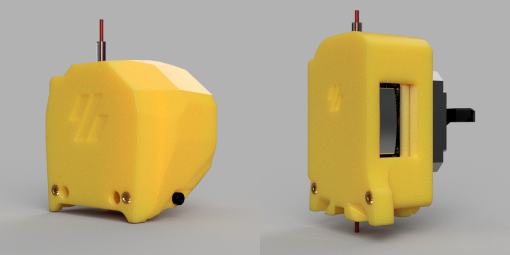
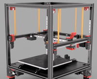
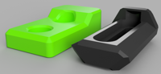
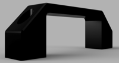
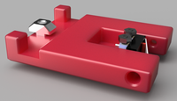

# 3D Printing
Printer mods, configs and other 3D printer stuff

## Mods
| |Name|For|Description|
|---|---|---|---|
||[Steamroller (Dedicated Repo)](https://github.com/tallman5/steamroller)|Voron 2.4|OMG mounts for various toolheads|
||[Z Locks](stl/voron/z-locks/readme.md)|Voron 2.4|Use as helping hands instead of zip ties|
||[X/Y Sensorless Endstops](stl/rat-rig/)|V-Core 3.0|Longer bumpers needed for v3.0|
||[Panel Handle](stl/general/panel-handle.stl)|Anywhere|Light duty panel handle. Uses M6s, hole spacing is 89mm. This was not designed to lift an entire printer!|
||[Filament Runout Sensor](stl/general/filament-runout-sensor.stl)|Anywhere|Mounts onto 2020 frames, uses standard microswitch|

## BOMs
The BOMs below are generated right from the CAD files.
The script is in the [src/fusion-scripts](src/fusion-scipts/) folder.

| |BOM|
|---|---|
||[Voron 2.4R2](/printers/voron/v2.4/Voron%202.4R2%20BOM.md)|
||[Rat Rig V-Core v3.1 200](printers/rat-rig/v-core/Enclosure%202.0%20Assembly%20-%20200x200x200%20BOM.md)|
||[EVA](printers/eva/EVA3%20Assembly%20BOM.md)|
