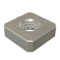

# EVA3 Assembly BOM

|Image|Number|Quantity|Description|
|-|-|-|-|
|||4||
||40mm_fan_inlet|1||
||_Belt Loop for EVA3|2||
||_LGX Lite Back|1||
||_LGX Lite Body|1||
||_LGX Lite Face|1||
||_LGX Lite Motor|1||
||_M3x25 LP-SHCS A|1||
||_M3x25 LP-SHCS B|1||
||_MGN12C Carriage|1||
||back_core_xy|1||
||bottom_horns|1||
||cable_guide|1||
||cable_guide_mount|1||
||core_xy_belt_grabber|2||
||drive_lgx_lite|1||
||face_belt_grabber|2||
||front_universal|1||
||hotend_rapido|1||
||HW1039NC|2||
||HW1251NC|2||
||HW1290SC|1||
||HW1292SC|5||
||HW1502SC|28||
||HW1504SC|4||
||HW1508NC|33||
||HW1868SC|9||
||HW2010NC|4||
||HW2138SC|2||
||HW2685EC|1||
||HW2815EC|1||
||HW2840EC|1||
||HW2901EC|1||
||HW2907GC|1||
||HW2962EC|1||
||lj8_probe_mount|1||
||Phaetus Rapido HF|1||
||ratrig_eva3_shroud|1||
||top_endstop_mgn12c|1||