# EVA3 Assembly BOM

|Image|Name|Number|Description|Quantity|
|-|-|-|-|-|
|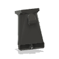|40mm_fan_inlet v1:1|40mm_fan_inlet||1|
||_Belt Loop for EVA3 v1:1|_Belt Loop for EVA3||2|
|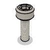|_Cap Head Screw M2.5x8 v1:1|||4|
||_MGN12C Carriage v1:1|_MGN12C Carriage||1|
|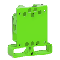|back_core_xy v1:1|back_core_xy||1|
|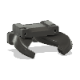|bottom_horns v1:1|bottom_horns||1|
||cable_guide v1:1|cable_guide||1|
||cable_guide_mount v1:1|cable_guide_mount||1|
|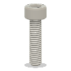|Cap Head Screw M3x12 v1:1|HW1292SC||5|
|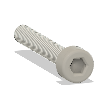|Cap Head Screw M3x20 v1:1|HW1504SC||4|
|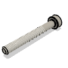|Cap Head Screw M3x25 v1:1|HW1290SC||1|
|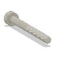|Cap Head Screw M3x35 v1:1|HW1868SC||9|
|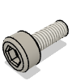|Cap Head Screw M3x8 v1:1|HW1502SC||28|
|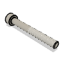|Cap Head Screw M5x40 v1:1|HW2138SC||2|
|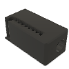|core_xy_belt_grabber v1:1|core_xy_belt_grabber||2|
|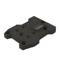|drive_lgx_lite v1:1|drive_lgx_lite||1|
|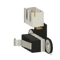|Endstop Module - Horizontal Limit Switch v1:1|HW2685EC||1|
||face_belt_grabber v1:1|face_belt_grabber||2|
|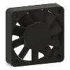|Fan - 40mm Axial Brushless 24V DC v3:1|HW2815EC|https://amzn.to/41pzbJc|1|
||front_universal v1:1|front_universal||1|
|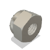|Hex Locking Nut - M3 v1:1|HW1251NC||2|
|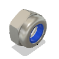|Hex Locking Nut - M5 v1:1|HW1039NC||2|
|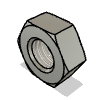|Hex Nut - M3 v1:1|HW1508NC||33|
|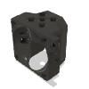|hotend_rapido v1:1|hotend_rapido||1|
||LGX Lite Extruder by Bondtech v3:1|HW2840EC|https://amzn.to/3KPKHXb|1|
|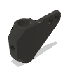|lj8_probe_mount v1:1|lj8_probe_mount||1|
||Phaetus Rapido HF v2:1|Phaetus Rapido HF|https://amzn.to/40qOLD5|1|
|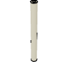|PTFE Tube - 43.7mm v1:1|HW2907GC||1|
|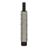|Rat Rig SuperPinda Probe by P&F v3:1|HW2901EC|W/ thermistor for chamber temp: https://amzn.to/3KVdmdu|1|
||ratrig_eva3_shroud v1:1|ratrig_eva3_shroud||1|
|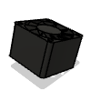|SANYO DENKI 4028 Axial Fan - 9GAX0412P3S001 v2:1|HW2962EC|https://amzn.to/3GUQ2eM|1|
|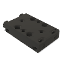|top_endstop_mgn12c v1:1|top_endstop_mgn12c||1|