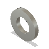

# Electronics Panel 400 BOM

|Image|Name|Number|Description|Quantity|
|-|-|-|-|-|
||Cap Head Screw M6x12 v1:20|HW1836SC||36|
||M6 T-Nut 3030 v3:20|M6 T-Nut 3030||36|
||panel_electronics_400_plain v1:1|panel_electronics_400_plain||1|
||Washer Simple M6 v2:20|HW1314NC|https://amzn.to/3Kp5wbQ|36|