# Enclosure 2.0 Assembly - 400x400x400 BOM

|Image|Name|Number|Description|Quantity|
|-|-|-|-|-|
||3030_panel_mount_horizontal v1:1|3030_panel_mount_horizontal||2|
||40mm_fan_inlet v1:1|40mm_fan_inlet||1|
||_Belt Loop for EVA3 v1:1|_Belt Loop for EVA3||2|
|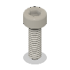|_Cap Head Screw M2.5x8 v1:1|||4|
||_CoreXY Belts - 400 v1:1|_CoreXY Belts - 400||1|
||_MGN12C Carriage v2:1|_MGN12C Carriage||6|
||_ptfe_filament_guide - 400 v2:1|_ptfe_filament_guide - 400|https://amzn.to/3o2Rdlr|1|
||_RatRig Green Filament Spool v1:1|_RatRig Green Filament Spool||1|
||_SHCS M3x8 Bottom:1|_SHCS M3x8 Bottom||3|
||_SHCS M3x8 Top:1|_SHCS M3x8 Top||3|
|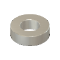|Aluminium Spacer - 3mm v1:1|HW1016NC||2|
||Aluminium Spacer - 6mm v1:1|HW1018NC||15|
||back_core_xy v1:1|back_core_xy||1|
|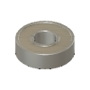|Ball Bearing - 695ZZ v1:1|HW2948WC||12|
||Ball Bearing - F688ZZ v1:1|HW1309WC||3|
|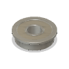|Ball Bearing - F695ZZ v1:1|HW2947WC||24|
||Bed Plate - Cast tooling plate - Pre-Machined - 429*429*6mm v1:1|HW2199PC||1|
||bed_arm_back_3.1 v1:1|bed_arm_back_3.1||1|
|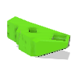|bed_arm_left_3.1 v1:1|bed_arm_left_3.1||1|
|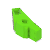|bed_arm_right_3.1 v1:1|bed_arm_right_3.1||1|
|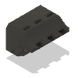|bed_cable_relief v1:1|bed_cable_relief||1|
||bottom_horns v1:1|bottom_horns||1|
|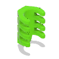|cable_guide v1:1|cable_guide||1|
|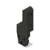|cable_guide_mount v1:1|cable_guide_mount||1|
||Cap Head Screw M3x12 v1:1|HW1292SC||119|
|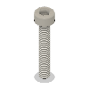|Cap Head Screw M3x18 v1:1|HW1866SC||12|
|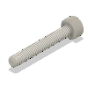|Cap Head Screw M3x20 v1:1|HW1504SC||12|
|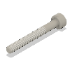|Cap Head Screw M3x25 v1:1|HW1290SC||1|
|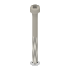|Cap Head Screw M3x35 v1:1|HW1868SC||19|
|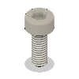|Cap Head Screw M3x8 v1:1|HW1502SC||68|
||Cap Head Screw M5x10 v1:1|HW1285SC||5|
|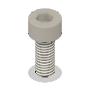|Cap Head Screw M5x12 v1:1|HW1202SC||2|
||Cap Head Screw M5x18 v1:1|HW2110SC||5|
|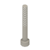|Cap Head Screw M5x40 v1:1|HW2138SC||6|
|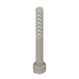|Cap Head Screw M5x45 v2:1|HW2074SC|https://amzn.to/3ZXxDVg|2|
||Cap Head Screw M5x55 v1:1|HW2140SC||4|
||Cap Head Screw M6x12 v1:1|HW1836SC||309|
||Cap Head Screw M6x16 v1:1|HW2827SC||8|
||Cap Head Screw M6x20 v1:1|HW1870SC||9|
|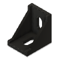|Cast 90 Degree Corner Bracket for 3030 - 6 Slot - Black v1:1|HW1916BC||12|
||core_xy_belt_grabber v1:1|core_xy_belt_grabber||2|
|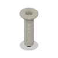|Countersink Screw M3x12 v1:1|HW1874SC||6|
|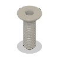|Countersink Screw M5x16 v1:1|HW2349SC||3|
|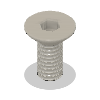|Countersink Screw M6x14 v1:1|HW2173SC||6|
|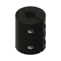|Coupler - Rigid Type - Black 25x20mm - 5mm to 8mm v1:1|HW2990GC||3|
|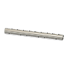|Dowel Pin - 3x35mm v1:1|HW2126GC||6|
|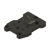|drive_lgx_lite v1:1|drive_lgx_lite||1|
||electronics_wire_guide v1:1|electronics_wire_guide||5|
|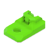|electronics_wire_guide_rear v1:1|electronics_wire_guide_rear||1|
|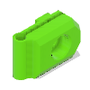|enclosure2_bowden_clamp v1:1|enclosure2_bowden_clamp||1|
|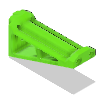|enclosure2_spool_holder_4mm v1:1|enclosure2_spool_holder_4mm||1|
|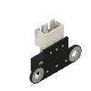|Endstop Module - Horizontal Limit Switch v1:1|HW2685EC||2|
|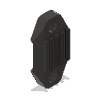|face_belt_grabber v1:1|face_belt_grabber||2|
||Fan - 40mm Axial Brushless 24V DC v2:1|HW2815EC||1|
||FlexPlate Set - Powder coated PEI 410x410mm v1:1|HW1896GC||1|
||Foam Seal - Front 400 v2:1|Foam Seal - Front 400|https://amzn.to/3ME23bQ|1|
||Foam Seal - Top 400 v2:1|Foam Seal - Top 400|https://amzn.to/3ME23bQ|1|
||front_universal v1:1|front_universal||1|
||Hex Locking Nut - M3 v1:1|HW1251NC||22|
||Hex Locking Nut - M5 v1:1|HW1039NC||13|
||Hex Locking Nut - M6 v2:1|HW1311NC|https://amzn.to/3UriKti|28|
|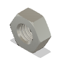|Hex Nut - M3 v1:1|HW1508NC||33|
|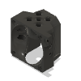|hotend_rapido v1:1|hotend_rapido||1|
||idler_plate_enclosure_2.0_v1.0 v1:1|HW3056PC||4|
|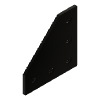|Joining Plate for 3030 - 90 Degree - Black Anodized v1:1|HW1915PC||20|
|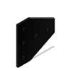|Joining Plate for 3030 - T - Black Anodized v2:1|HW1914PC|https://amzn.to/40U6ow3|6|
||Keenovo 380x380 1000W Silicone Heater Pad v1:1|HW2347EK||1|
||Lead Screw - TR8*4 Metric Acme Lead Screw - 480mm v1:1|HW2192SC||3|
|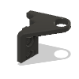|lead_screw_constraint_front_left_3.1 v1:1|lead_screw_constraint_front_left_3.1||1|
|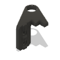|lead_screw_constraint_front_right_3.1 v1:1|lead_screw_constraint_front_right_3.1||1|
|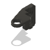|lead_screw_constraint_rear_3.1 v1:1|lead_screw_constraint_rear_3.1||1|
|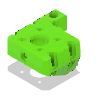|lead_screw_motor_cage_back_3.1 v1:1|lead_screw_motor_cage_back_3.1||1|
||lead_screw_motor_cage_back_trim_3.1 v1:1|lead_screw_motor_cage_back_trim_3.1||1|
||lead_screw_motor_cage_front_3.1 v1:1|lead_screw_motor_cage_front_3.1||2|
||lead_screw_motor_cage_front_trim_3.1 v1:1|lead_screw_motor_cage_front_trim_3.1||2|
|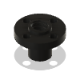|Leadscrew Nut - POM - TR8*4 v1:1|HW2915GC||3|
||LGX Lite Extruder by Bondtech v6:1|HW2840EC||1|
||Linear Rail - MGN12 450mm + MGN12C carriage v1:1|HW2036GC||2|
||Linear Rail - MGN12 500mm + MGN12C carriage v1:1|HW2034GC||4|
|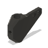|lj8_probe_mount v1:1|lj8_probe_mount||1|
||M6 T-Nut 3030 v3:1|M6 T-Nut 3030||304|
|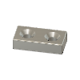|Magnet - 20x10x5mm - Two hole (M3 Countersink screws) v1:1|HW2127GC||3|
||Magnet - Neodymium disc shape - 10mm x 4mm v2:1|HW2828GC|https://amzn.to/3GvYwIX|40|
|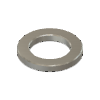|Mini Precision Shim - 8x5x1mm v1:1|HW1630NC||28|
|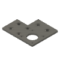|motor_plate_v1.0 v1:1|HW2202PC||2|
|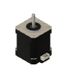|Nema 17 Stepper Motor - 48mm - 1.8degree/step, 76oz-in v1:1|HW1078EC||5|
|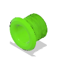|panel_collar v1:1|panel_collar||1|
|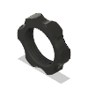|panel_collar_nut v1:1|panel_collar_nut||1|
||panel_electronics_split_400 v1:1|panel_electronics_split_400||1|
||panel_enc2_back_400 v1:1|panel_enc2_back_400||1|
||panel_enc2_base_400 v1:1|panel_enc2_base_400||1|
||panel_enc2_door_400 v1:1|panel_enc2_door_400||1|
||panel_enc2_side_400 v1:1|panel_enc2_side_400||2|
||panel_enc2_top_400 v1:1|panel_enc2_top_400||1|
||panel_magnet_holder v1:1|panel_magnet_holder||10|
|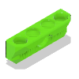|panel_magnet_mount v1:1|panel_magnet_mount||10|
||Phaetus Rapido HF v3:1|Phaetus Rapido HF|https://amzn.to/3mfy9QJ|1|
|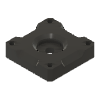|pillow_block v1:1|pillow_block||3|
||PTFE Tube - 43.7mm v2:1|HW2907GC|https://amzn.to/3o2Rdlr|3|
||Rat Rig Bi-Material Lead Screw Decoupler v1:1|HW2950WC||3|
|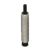|Rat Rig SuperPinda Probe by P&F v3:1|HW2901EC|https://amzn.to/43hJOyV - includes thermistor for chamber temp|1|
||ratrig_eva3_shroud v1:1|ratrig_eva3_shroud||1|
|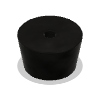|Rubber foot with metal insert - Heavy Duty - 28_22_16.5mm v1:1|HW2125GC||4|
||SANYO DENKI 4028 Axial Fan - 9GAX0412P3S001 v3:1|HW2962EC|https://amzn.to/3KLWyqf|1|
||shelf_left_400_3.1 v1:1|shelf_left_400_3.1||1|
||shelf_right_400_3.1 v1:1|shelf_right_400_3.1||1|
|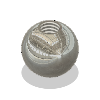|Steel Ball - 12mm - Threaded M5 v1:1|HW2128GC||3|
||T-Nut - Drop In for 2020 - M3 v1:1|HW1665NC||20|
||T-Nut - Drop In for 3030 - M3 v1:1|HW1821NC||96|
||T-Nut - Drop In for 3030 - M5 v1:1|HW1383NC||1|
||T-Nut - Square type for 2020 - M5 v1:1|HW1522NC||6|
||T-Slot 3030 - Black - 605mm v1:1|HW306BRC||20|
||Thrust Bearing F8-16M v2:1|HW2118WC|https://amzn.to/3KPudja|3|
||Timing Pulley - 2GT (2mm) - 20 Tooth - For 9mm Belt - 5mm Bo v1:1|HW1654WC||2|
||top_endstop_mgn12c v1:1|top_endstop_mgn12c||1|
||V-Slot 2020 - Black - 522mm v1:1|HW201BRC||1|
||V-Slot Door Handle v1:1|HW1555GC||4|
||VC3-XY_Joiner_Plate_v1.1 v1:1|HW2949PC||2|
||Washer Simple M6 v2:1|HW1314NC|https://amzn.to/3Kp5wbQ|127|
||x_endstop_block_3.1 v1:1|x_endstop_block_3.1||1|
||xy_joiner_left_3.1 v1:1|xy_joiner_left_3.1||1|
||xy_joiner_right_3.1 v1:1|xy_joiner_right_3.1||1|
||xy_motor_cage_bottom_left_3.1 v1:1|xy_motor_cage_bottom_left_3.1||1|
||xy_motor_cage_bottom_right_3.1 v1:1|xy_motor_cage_bottom_right_3.1||1|
||xy_motor_cage_top_left_3.1_cutout v1:1|xy_motor_cage_top_left_3.1_cutout||1|
||xy_motor_cage_top_right_3.1_cutout v1:1|xy_motor_cage_top_right_3.1_cutout||1|
||xy_motor_suport_left_3.1 v1:1|xy_motor_suport_left_3.1||1|
||xy_motor_suport_right_3.1 v1:1|xy_motor_suport_right_3.1||1|
||y_max_endstop_block_3.1 v1:1|y_max_endstop_block_3.1||1|
||y_max_endstop_slider_3.1 v1:1|y_max_endstop_slider_3.1||1|
||y_min_bumper v1:1|y_min_bumper||2|