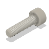
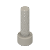
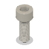
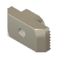

# Enclosure 2.0 Frame Assembly - 400 BOM

|Image|Name|Number|Description|Quantity|
|-|-|-|-|-|
||3030_panel_mount_horizontal v1:1|3030_panel_mount_horizontal||2|
||Cap Head Screw M3x12 v1:1|HW1292SC||96|
||Cap Head Screw M5x18 v1:1|HW2110SC||4|
||Cap Head Screw M6x12 v1:1|HW1836SC||230|
||Cap Head Screw M6x16 v1:1|HW2827SC||8|
||Cast 90 Degree Corner Bracket for 3030 - 6 Slot - Black v1:1|HW1916BC||12|
||Foam Seal - Front 400 v1:1|Foam Seal - Front 400||1|
||Foam Seal - Top 400 v1:1|Foam Seal - Top 400||1|
||Hex Locking Nut - M6 v1:1|HW1311NC||28|
||Joining Plate for 3030 - 90 Degree - Black Anodized v1:1|HW1915PC||20|
||Joining Plate for 3030 - T - Black Anodized v1:1|HW1914PC||6|
||Linear Rail - MGN12 450mm + MGN12C carriage v1:1|HW2036GC||2|
||Linear Rail - MGN12 500mm + MGN12C carriage v1:1|HW2034GC||3|
||M6 T-Nut 3030 v3:1|M6 T-Nut 3030||210|
||Magnet - Neodymium disc shape - 10mm x 4mm v1:1|HW2828GC||40|
||panel_enc2_back_400 v1:1|panel_enc2_back_400||1|
||panel_enc2_door_400 v1:1|panel_enc2_door_400||1|
||panel_enc2_side_400 v1:1|panel_enc2_side_400||2|
||panel_enc2_top_400 v1:1|panel_enc2_top_400||1|
||panel_magnet_holder v1:1|panel_magnet_holder||10|
||panel_magnet_mount v1:1|panel_magnet_mount||10|
||Rubber foot with metal insert - Heavy Duty - 28_22_16.5mm v1:1|HW2125GC||4|
||T-Nut - Drop In for 3030 - M3 v1:1|HW1821NC||96|
||T-Slot 3030 - Black - 605mm v1:1|HW306BRC||20|
||V-Slot Door Handle v1:1|HW1555GC||4|
||Washer Simple M6 v1:1|HW1314NC||92|