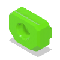
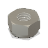
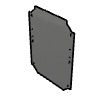
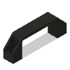

# Enclosure 2.0 Paneling - 400 BOM

|Image|Name|Number|Description|Quantity|
|-|-|-|-|-|
||3030_panel_mount_horizontal v1:1|3030_panel_mount_horizontal||2|
||Cap Head Screw M6x12 v1:1|HW1836SC||129|
||Cap Head Screw M6x16 v1:1|HW2827SC||8|
||Foam Seal - Front 400 v2:1|Foam Seal - Front 400|https://amzn.to/3ME23bQ|1|
||Foam Seal - Top 400 v2:1|Foam Seal - Top 400|https://amzn.to/3ME23bQ|1|
||Hex Locking Nut - M6 v2:1|HW1311NC|https://amzn.to/3UriKti|28|
||M6 T-Nut 3030 v3:1|M6 T-Nut 3030||109|
||Neodymium Disc Magnet - 10x4mm v2:1|HW2828GC|https://amzn.to/3GvYwIX|40|
||panel_electronics_400_plain v1:1|panel_electronics_400_plain||1|
||panel_enc2_back_400 v1:1|panel_enc2_back_400||1|
||panel_enc2_base_400 v1:1|panel_enc2_base_400||1|
||panel_enc2_door_400 v1:1|panel_enc2_door_400||1|
||panel_enc2_side_400 v1:1|panel_enc2_side_400||2|
||panel_enc2_top_400 v1:1|panel_enc2_top_400||1|
||panel_magnet_holder v1:1|panel_magnet_holder||10|
||panel_magnet_mount v1:1|panel_magnet_mount||10|
||V-Slot Door Handle v1:1|HW1555GC||4|
||Washer Simple M6 v2:1|HW1314NC|https://amzn.to/3Kp5wbQ|117|