# Stealthburner CW2 Assembly BOM

|Image|Name|Number|Description|Quantity|
|-|-|-|-|-|
||40x40x10 DC Fan v2 (1):1|40x40x10 DC Fan v2 (1)||1|
|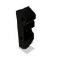|adxl_mount_generic_15.5_hole_c-c:1|adxl_mount_generic_15.5_hole_c-c||1|
|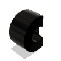|adxl_screw_spacer:1|adxl_screw_spacer||2|
|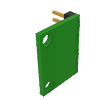|asxl345_sensor_generic:1|asxl345_sensor_generic||1|
||BMG Spring:1|BMG Spring||1|
||bottom (1):1|bottom (1)||1|
||cable_cover:1|cable_cover||1|
||cable_cover_for_pcb:1|cable_cover_for_pcb||1|
|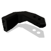|chain_anchor_2hole:1|chain_anchor_2hole||1|
|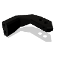|chain_anchor_2hole_sw:1|chain_anchor_2hole_sw||1|
|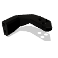|chain_anchor_3hole_sw:1|chain_anchor_3hole_sw||1|
||CW2 chain anchor (3-hole):1|CW2 chain anchor (3-hole)||1|
||DIN 913 - M3 x 2:1|DIN 913 - M3 x 2||1|
||DIN EN ISO 4762 - M3 x 50:1|DIN EN ISO 4762 - M3 x 50||2|
||DIN EN ISO 7049 - ST2.2 x 6.5 - F - Z:1|DIN EN ISO 7049 - ST2.2 x 6.5 - F - Z||2|
||DIN EN ISO 7089 -  3:1|DIN EN ISO 7089 -  3||1|
||Direct_Drivegear (1):1|Direct_Drivegear (1)||1|
||guidler_b:1|guidler_b||1|
|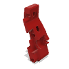|guilder_a:1|guilder_a||1|
||K3x5x7 Needlebearing (1) (1):1|K3x5x7 Needlebearing (1) (1)||2|
|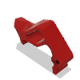|Latch:1|Latch||1|
|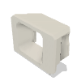|led_carrier:1|led_carrier||1|
|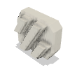|led_diffuser:1|led_diffuser||1|
|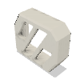|led_diffuser_mask:1|led_diffuser_mask||1|
||M3 Threaded Insert:1|M3 Threaded Insert||21|
||M3 Thumb Screw (1) (1):1|M3 Thumb Screw (1) (1)||1|
||M3x10 SHCS:1|M3x10 SHCS||2|
||M3x12 SHCS:1|M3x12 SHCS||2|
||M3x16 SHCS:1|M3x16 SHCS||4|
||M3x20 SHCS:1|M3x20 SHCS||1|
||M3x25 SHCS:5|M3x25 SHCS||6|
||M3x30 SHCS:1|M3x30 SHCS||1|
||M3x6 BHCS:1|M3x6 BHCS||1|
||M3x6 FHCS:2|M3x6 FHCS||3|
||M3x8 SHCS:1|M3x8 SHCS||6|
|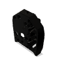|main_body:1|main_body||1|
|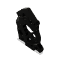|motor_plate:1|motor_plate||1|
||MR825 Ballbearing 5x8x2:1|MR825 Ballbearing 5x8x2||2|
|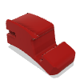|NewShuttle:1|NewShuttle||1|
||Nylon Washer (Thumbscrew):1|Nylon Washer (Thumbscrew)||1|
||P6 Assembly (RevC):1|P6 Assembly (RevC)||1|
|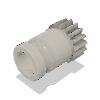|Part36:1|Part36||1|
|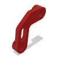|pcb_spacer:1|pcb_spacer||1|
||PTFE Tube Revo Voron 29.8:1|PTFE Tube Revo Voron 29.8||1|
|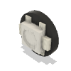|rgbw_led_pcb:1|rgbw_led_pcb||3|
||Shaft-assembly (1):1|Shaft-assembly (1)||1|
||stealthburner_body:1|stealthburner_body||1|
||Stepper Body (1):1|Stepper Body (1)||1|
||stift 3 x 20 (1) (1):1|stift 3 x 20 (1) (1)||1|
||Toolhead Revo Voron Front:1|Toolhead Revo Voron Front||1|
||Toolhead Revo Voron Rear:1|Toolhead Revo Voron Rear||1|
||turbine (1):1|turbine (1)||1|